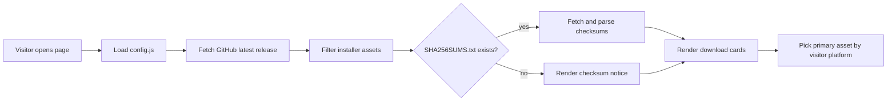
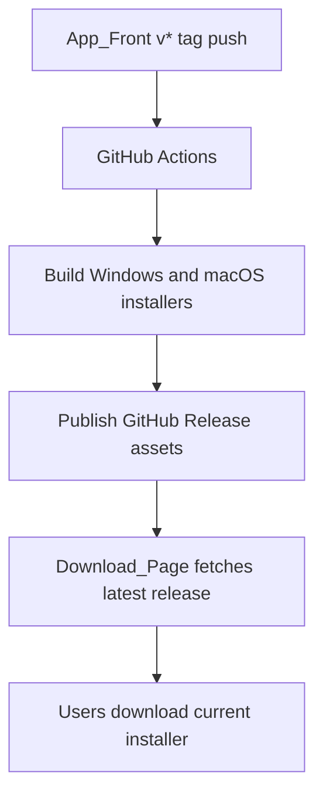

<div align="center">

# Maily Download Page

Maily Desktop App Download

Maily 서비스 소개와 최신 데스크톱 설치 파일 다운로드를 제공하는 정적 랜딩 페이지입니다.


[](https://github.com/GachonCapstone4/App_Front/releases)


[Overview](#overview) · [Features](#features) · [Quick Start](#quick-start) · [Configuration](#configuration) · [Deployment](#deployment)

</div>

## Overview

`Download_Page`는 별도 빌드 단계 없이 배포되는 정적 페이지입니다. 서비스 소개, 사용 흐름 애니메이션, 최신 릴리스 정보, 설치 파일 다운로드 링크를 한 화면에서 제공합니다.

페이지는 `config.js`의 `releaseRepository` 값을 기준으로 GitHub Releases API의 latest release를 조회합니다. `App_Front` 저장소에 새 `v*` 태그 릴리스가 올라오면 다운로드 페이지를 다시 배포하지 않아도 최신 설치 파일이 자동으로 표시됩니다.

| Area | Implementation |
| --- | --- |
| Service intro | HTML/CSS로 구성한 hero, 기능 소개, 사용 흐름 |
| Scenario | hover/focus 기반 장면 전환과 3초 자동 순환 |
| Release lookup | `https://api.github.com/repos/{owner}/{repo}/releases/latest` |
| Asset filter | `.dmg`, `.exe`, `.msi` 설치 파일만 표시 |
| Primary download | 방문자 OS에 따라 Windows `.exe`, macOS `.dmg` 우선 선택 |
| Checksum | `SHA256SUMS.txt`가 있으면 asset별 SHA256 표시 |
| Deployment | Vercel static hosting, SPA fallback rewrite |

## Features

| Feature | Description |
| --- | --- |
| 제품 소개 hero | Maily 업무 흐름을 데스크톱 앱 UI mock으로 보여줍니다. |
| 사용 흐름 섹션 | 수신함, AI 초안, 캘린더 후보, 자동화 장면을 hover/focus 입력과 3초 자동 순환으로 전환합니다. |
| 최신 버전 표시 | GitHub latest release의 tag, published date, release note 링크를 표시합니다. |
| 플랫폼별 다운로드 | Release asset 중 설치 파일만 골라 Windows/macOS 카드로 렌더링합니다. |
| 자동 primary link | `navigator.platform`을 기준으로 상단 다운로드 버튼의 대상 asset을 고릅니다. |
| SHA256 표시 | `SHA256SUMS.txt` release asset이 있으면 파일명별 checksum을 매칭합니다. |
| 실패 상태 | GitHub API 호출 실패 또는 설치 파일 없음 상태를 사용자에게 안내합니다. |
| 정적 배포 | package manager나 build tool 없이 HTML, CSS, JS, SVG만으로 동작합니다. |

## Quick Start

정적 파일만으로 동작하므로 로컬에서는 간단한 HTTP 서버로 확인합니다.

```bash
python -m http.server 4173
```

브라우저에서 `http://localhost:4173`을 엽니다.

파일을 직접 열어도 대부분의 UI는 보이지만, GitHub Release fetch와 브라우저 보안 정책을 실제 배포와 가깝게 확인하려면 HTTP 서버 실행을 권장합니다.

## Configuration

`config.js`:

```js
window.MAILY_DOWNLOAD_CONFIG = {
  releaseRepository: "GachonCapstone4/App_Front",
};
```

| Field | Description |
| --- | --- |
| `releaseRepository` | latest release를 조회할 GitHub 저장소, `owner/repo` 형식 |

다운로드 대상 저장소를 바꾸려면 `releaseRepository`만 수정합니다.

## Release Asset Rules

페이지가 다운로드 카드로 표시하는 파일 확장자는 아래와 같습니다.

| Extension | Label |
| --- | --- |
| `.exe` | Windows |
| `.msi` | Windows |
| `.dmg` | macOS |

`SHA256SUMS.txt`가 release asset에 있으면 아래 형식의 줄을 파싱합니다.

```text
<64-char-sha256>  <asset-file-name>
```

예시:

```text
0123456789abcdef0123456789abcdef0123456789abcdef0123456789abcdef  Maily-0.2.1-win-x64.exe
```

## How It Works



## File Structure

```text
Download_Page/
├─ assets/
│  └─ maily-icon.svg
├─ app.js          # release fetch, asset rendering, scenario step rotation
├─ config.js       # target GitHub release repository
├─ index.html      # page structure
├─ styles.css      # responsive visual design
├─ vercel.json     # static hosting headers and rewrite
└─ README.md
```

## Deployment

Vercel 설정:

| Setting | Value |
| --- | --- |
| Root Directory | `Download_Page` |
| Framework Preset | `Other` |
| Build Command | empty |
| Output Directory | `.` |

`vercel.json`은 모든 경로를 `index.html`로 rewrite하고, 정적 페이지가 항상 최신 릴리스 정보를 다시 확인할 수 있도록 `Cache-Control: public, max-age=0, must-revalidate` 헤더를 설정합니다.

## Tech Stack

| Layer | Technology | Role |
| --- | --- | --- |
| Markup | HTML | 페이지 구조 |
| Style | CSS | responsive layout, hero, scenario animation |
| Runtime | Vanilla JavaScript | GitHub API fetch, DOM rendering, platform detection |
| API | GitHub Releases API | latest release와 asset metadata 조회 |
| Deploy | Vercel | static hosting |

## App Release Flow



## Caution

- GitHub API rate limit이나 네트워크 오류가 있으면 다운로드 카드는 실패 상태로 표시됩니다.
- 표시 가능한 설치 파일은 `.dmg`, `.exe`, `.msi`입니다.
- 자동 업데이트용 `latest*.yml`, `*.blockmap`, `.zip`은 App_Front 릴리스에는 필요하지만 이 다운로드 페이지의 설치 카드에는 표시하지 않습니다.
- `releaseRepository`를 private repository로 바꾸면 브라우저에서 인증 없이 latest release를 조회할 수 없습니다.
